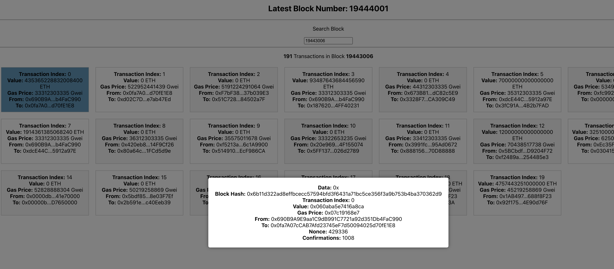

# Ethereum Transaction Explorer

This Ethereum Transaction Explorer is a small React application that allows users to view transaction details on the Ethereum blockchain. Users can click on individual transactions to view more information about them in a popup.

## Screenshot



## Features

- Display a list of Ethereum transactions.
- View transaction details including transaction index, value, gas price, sender, recipient, nonce, and confirmations.
- Click on a transaction to view detailed information in a popup.

## Usage

1. Clone the repository

2. Navigate to the project directory:
   ```bash
   cd blockexplorer
   ```

3. Install dependencies:
   ```bash
   yarn install
   ```

4. Set your Alchemy API key in the `.env` file:
   ```plaintext
   REACT_APP_ALCHEMY_API_KEY=your_alchemy_api_key
   ```

5. Start the development server:
   ```bash
   yarn start
   ```

6. Open your web browser and navigate to `http://localhost:3000` to view the application.

## Technologies Used

- React.js
- Alchemy SDK: Provides access to Ethereum blockchain data and functionality.
- Sass
- JavaScript
